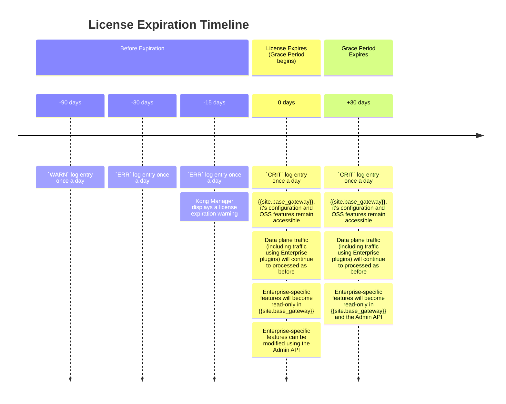


{{site.ee_product_name}} enforces the presence and validity of an Enterprise license file.



{{site.base_gateway}} can be used with or without a license. For Enterprise
functionality, {{site.base_gateway}} enforces the presence and validity of a
{{site.konnect_product_name}} license file.




| Feature            | Free Mode | Enterprise Subscription |
|--------------------|:---------:|:-----------------------:|
| Manager            | <i class="fa fa-check"></i> | <i class="fa fa-check"></i> |
| Admin API          | <i class="fa fa-check"></i> | <i class="fa fa-check"></i> |


| Vitals             | <i class="fa fa-times"></i> | <i class="fa fa-check"></i> |
| Dev Portal         | <i class="fa fa-times"></i> | <i class="fa fa-check"></i> |


| Enterprise plugins | <i class="fa fa-times"></i> | <i class="fa fa-check"></i> |



## Deploying the license file

* **Hybrid mode deployment:** The license file must be deployed to each control
plane and data plane node. Apply the license through the Kong Admin API to the
control plane. The control plane distributes the license to its data plane nodes.
This is the only method that applies the license to data planes automatically.
* **Traditional deployment with no separate control plane:** The license file must
be deployed to each node running {{site.base_gateway}}.

License file checking is done independently by each node as the Kong process starts; no network connectivity is necessary to execute the license validation process.

There are multiple ways to configure a license file on a {{site.base_gateway}} node. These are defined below, in the order in which they are checked by Kong:

1. If present, the contents of the environmental variable `KONG_LICENSE_DATA` are used.
2. Kong will search in the default location `/etc/kong/license.json`.
3. If present, the contents of the file defined by the environment variable `KONG_LICENSE_PATH` is used.
4. Directly deploy a license using the `/licenses` Admin API endpoint.

In this manner, the license file can be deployed either as a file on the node
filesystem, as an environmental variable, or through the `/licenses` Admin API
endpoint. The simplest method is using the Admin API.

Note that unlike most other `KONG_*` environmental variables, the
`KONG_LICENSE_DATA` and `KONG_LICENSE_PATH` cannot be defined in-line as part
of any `kong` CLI commands. License file environmental variables must be
exported to the shell in which the Nginx process will run, ahead of the `kong`
CLI tool.

For more information, see [Deploy Your License](/gateway/{{page.release}}/licenses/deploy/).

## Examining the license data on a {{site.base_gateway}} node

Retrieve license data using the Admin API's `/licenses` endpoint, or through
the Admin GUI in Kong Manager.

## License expiration

Licenses expire at 00:00 on the date of expiration, relative to the time zone the machine is running in.

### Before Expiration

- Kong Manager displays a banner with a license expiration warning starting 15 days before expiration
- Expiration warnings also appear in [{{site.base_gateway}} logs](#license-expiration-logs)

### After Expiration (30 day grace period)

- Kong Manager displays a banner with a license expiration warning for a 30 day grace period
- Critical expiration events appear in [{{site.base_gateway}} logs](#license-expiration-logs) 
- Kong Manager, its configuration and OSS features are accessible and may be changed
- [Enterprise-specific features](/gateway/{{page.release}}/kong-enterprise/) become read-only
  - [Enterprise-specific features](/gateway/{{page.release}}/kong-enterprise/) may be modified using the Admin API

### After Grace Period

- Kong Manager displays a banner with a license expiration warning
- Critical expiration events appear in [{{site.base_gateway}} logs](#license-expiration-logs) 
- Kong Manager, its configuration and OSS features are accessible and may be changed
- [Enterprise-specific features](/gateway/{{page.release}}/kong-enterprise/) become read-only in both {{site.base_gateway}} and the Admin API[^1]

[^1]: There may be some Enterprise features that are still writable, but they may also change later, so do not rely on this behavior.

### Data Plane Nodes
The behaviour of Data Plane nodes at license expiry depnd on the deployment mode:

- **Traditional:** Nodes will be able to restart/scale as needed.
- **Hybrid:** Existing data planes or new data planes **can accept** config from a control plane with an expired license.
- **DB-less and KIC:** New nodes **cannot** come up, restarts will break.

### Deploying a new license

To upload a new license, see [Deploy an Enterprise License](/gateway/{{page.release}}/licenses/deploy/).

### License expiration logs

{{site.base_gateway}} logs the license expiration date on the following schedule:
* 90 days before: `WARN` log entry once a day
* 30 days before: `ERR` log entry once a day
* At and after expiration: `CRIT` log entry once a day

## Troubleshooting

When a valid license file is properly deployed, license file validation is a transparent operation; no additional output or logging data is written or provided. If an error occurs when attempting to validate the license, or the license data is not valid, an error message will be written to the console and logged to the Kong error log, followed by the process quitting. Below are possible error messages and troubleshooting steps to take:

`license path environment variable not set`
: Neither the `KONG_LICENSE_DATA` nor the `KONG_LICENSE_PATH` environmental variables were defined, and no license file could be opened at the default license location (`/etc/kong/license.json`)

`internal error`
: An internal error has occurred while attempting to validate the license. Such cases are extremely unlikely; contact Kong support to further troubleshoot.

`error opening license file`
: The license file defined either in the default location, or using the `KONG_LICENSE_PATH` env variable, could not be opened. Check that the user executing the Nginx process (e.g., the user executing the Kong CLI utility) has permissions to read this file.

`error reading license file`
: The license file defined either in the default location, or using the `KONG_LICENSE_PATH` env variable, could be opened, but an error occurred while reading. Confirm that the file is not corrupt, that there are no kernel error messages reported (e.g., out of memory conditions, etc). This is a generic error and is extremely unlikely to occur if the file could be opened.

`could not decode license json`
: The license file data could not be decoded as valid JSON. Confirm that the file is not corrupt and has not been altered since you received it from Kong Inc. Try re-downloading and installing your license file from Kong Inc.
: If you still receive this error after reinstallation, contact Kong support.

`invalid license format`
: The license file data is missing one or more key/value pairs. Confirm that the file is not corrupt and has not been altered since you received it from Kong Inc. Try re-downloading and installing your license file from Kong Inc.
: If you still receive this error after reinstallation, contact Kong support.

`validation failed`
: The attempt to verify the payload of the license with the license's signature failed. Confirm that the file is not corrupt and has not been altered since you received it from Kong Inc. Try re-downloading and installing your license file from Kong Inc.
: If you still receive this error after reinstallation, contact Kong support.

`license expired`
: The system time is past the license's `license_expiration_date`.

`invalid license expiration date`
: The data in the `license_expiration_date` field is incorrectly formatted. Try re-downloading and installing your license file from Kong Inc.
: If you still receive this error after reinstallation, contact Kong support.
